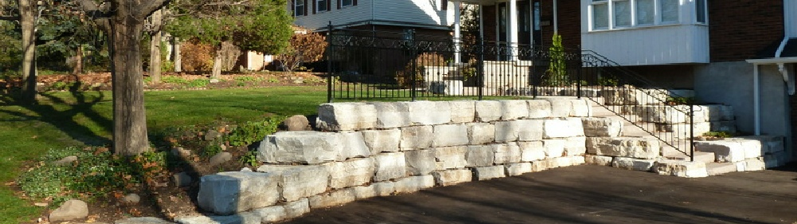

---
# You don't need to edit this file, it's empty on purpose.
# Edit theme's home layout instead if you wanna make some changes
# See: https://jekyllrb.com/docs/themes/#overriding-theme-defaults
layout: home
---

{:.home-banner}

{:.home-title}
## Professional hardscapers and interlocking installers since 1988

## What the heck is hardscaping?

Hardscaping, also called hard landscaping, is the action of creating a hardscape.

Hardscape means any area devoted to a landscape made up of hard wearing materials such as stone, brick, concrete and other construction materials, as opposed to soft landscape which is all plant life in a yard.

In other words, all the paved driveways, patios, walkways and heavy vertical structures like walls, steps and rocks constitute your hardscape.

An important and permanent part of a hardscape is formed by interlocking stone paver.

## [Driveways](/driveways)

<blockquote>
  It's the first thing home buyers see as soon as they step out of the car
</blockquote>

Interlocking driveways are very weight resistant, if the base is prepared correctly and the proper pavers are chosen.

Interlocking stones are much more durable than asphalt and do not chip or crack like concrete.

The distinctive driveway adds value and visual appeal to any property.

## [Patios](/patios)

<blockquote>
  Property looks beautiful when its patio is
</blockquote>

How about a small heaven in your backyard? Or a cozy interlock patio?

Interlocking provides an exclusive opportunity to decorate an outside area of your home. Patios are that sort of projects where the multitude of shapes, sizes, textures and colours of today's interlocking materials provides a vast spectrum of possible patterns

and design options.

## [Entrances](/entrances)

<blockquote>
  Finally, we have got the entrance we have always dreamed of. Why did we wait so long to get it done?”
</blockquote>

Front Entrance - this well-designed and solidly build small piece of art catches pedestrians’ eyes like a shiny diamond in a ring.  Its wide and comfortable steps welcome you home every day when you are coming back  from work and for less then a second the same thought comes to your mind - “they do a good job.”

## [Walls & Steps](/walls-and-steps)

<blockquote>
  We build perfectly convenient steps, long-lasting retaining walls and other vertical dimensions
</blockquote>

The most challenging task even for professional hardscapers is to build solid walls and steps.

All vertical structures require skill and experience that comes after many years of building them on a daily basis.
